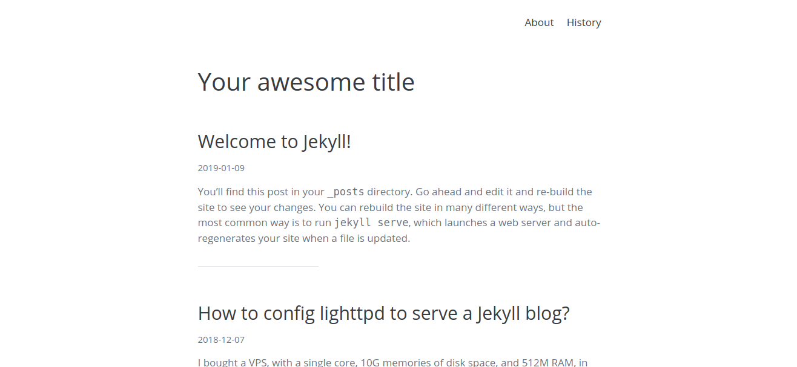

# Arktos

A minimalist Jekyll theme arktos.



Your can find a demo [here](https://erlzhang.github.io/arktos-demo/)!


## Installation

Add this line to your Jekyll site's `Gemfile`:

```ruby
gem "jekyll-theme-arktos"
```

And add this line to your Jekyll site's `_config.yml`:

```yaml
theme: jekyll-theme-arktos
```

And then execute:

    $ bundle

Or install it yourself as:

    $ gem install jekyll-theme-arktos

### If you are using Github Pages?

Add the following to your site’s `_config.yml` file.

```yml
remote_theme: erlzhang/jekyll-theme-arktos
```

## Usage

### Compatible with  jekyll-paginate-v2

But you should enable it in your `_config.yml`.

```yml
pagination:
  enabled: true
```

### Enabling Excerpts on the Home Page

To display post-excerpts on the Home Page, simply add the following to your `_config.yml`:

```yml
arktos:
  excerpt: true
```

### How to use mermaid?

<pre class="language-md">
```mermaid
graph TD;
    A-->B;
    A-->C;
    B-->D;
    C-->D;
```
</pre>

## Contributing

Bug reports and pull requests are welcome on GitHub at https://github.com/erlzhang/jekyll-theme-arktos. This project is intended to be a safe, welcoming space for collaboration, and contributors are expected to adhere to the [Contributor Covenant](http://contributor-covenant.org) code of conduct.

## License

The theme is available as open source under the terms of the [MIT License](https://opensource.org/licenses/MIT).
